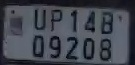
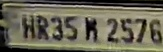
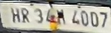
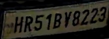
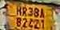
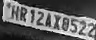
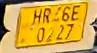

# Data-Intelligent ANPR: Scalable License Plate Recognition Under Real-World Data Constraints

## Abstract

This release provides Awiros-ANPR-OCR, a 37M-parameter specialist model for
Automatic Number Plate Recognition (ANPR) on Indian license plates. The model
is built on the PP-OCRv5 encoder-decoder backbone (SVTR_HGNet with PPHGNetV2_B4)
and fine-tuned on a curated 558,767-sample corpus spanning both standard
single-row and non-standard dual-row Indian plate formats.

Starting from only 6,839 publicly available labeled samples, the training
corpus was grown through a data engineering pipeline combining synthetic data
synthesis, consensus pseudo-labeling, distribution-aware curation, VLM-assisted
data cleanup, and state-balanced batch sampling. The resulting model achieves
**98.42% accuracy** with **sub-6ms on-device inference** on an NVIDIA RTX 3090
--- a 1,260x latency advantage over frontier multimodal models like Gemini.

For the full data curation and training methodology, refer to our technical
report: [Technical Report](TechnicalReport.pdf).

## Evaluation and Results

All systems were evaluated on a shared held-out validation set constructed
using a distribution-aware split covering all Indian state codes, including
both standard and non-standard plate formats.

| System | Params | Overall Acc. | 1-Row Acc. | 2-Row Acc. | Latency Avg (ms) | Throughput (img/s) |
| --- | --- | --- | --- | --- | --- | --- |
| **Awiros-ANPR-OCR (Ours)** | **37.3M** | **98.42%** | **98.83%** | **96.91%** | **5.09** | **196.5** |
| Gemini-3-flash-preview | ~5-10B | 93.89% | 94.70% | 91.20% | 6,430 | 0.2 |
| Gemini-2.5-flash-preview | ~5B | 87.23% | 89.66% | 78.38% | --- | --- |
| Tencent HunyuanOCR | 996M | 67.62% | 76.65% | 34.78% | 309.15 | 3.2 |
| PP-OCRv5 Pretrained | 53.6M | 57.96% | 73.55% | 0.24% | 5.25 | 190.6 |

Latency measured on a single NVIDIA RTX 3090 GPU (batch size 1). Gemini
latency is end-to-end API round-trip. PP-OCRv5 Pretrained shares the same
architecture but uses original pretrained weights without domain-specific
fine-tuning --- the 57.96% to 98.42% gap is entirely a data story.

## Qualitative Comparison

Representative samples where Awiros-ANPR-OCR correctly transcribes the plate
while all baselines produce errors. Common failure modes for baselines include
confusing visually similar characters (Q→0, V→Y, M→R, B→8) and truncating
dual-row plates.

| Plate Image | Ground Truth | Awiros (Ours) | Gemini 3 | Gemini 2.5 | Tencent |
| --- | --- | --- | --- | --- | --- |
|  | `UP14BQ9208` | `UP14BQ9208` | `UP14B09208` | `UP14B09208` | `UP14B` |
|  | `HR35M2576` | `HR35M2576` | `HR35R2576` | `HR35R2576` | `HR35K2576` |
|  | `HR34M4007` | `HR34M4007` | `HR34H4007` | `HR34M40D7` | `HR36M4007` |
|  | `HR51BV8223` | `HR51BV8223` | `HR51BY8223` | `HR51BY8223` | `HR51BY8223` |
|  | `HR38AB2421` | `HR38AB2421` | `HR38A8242` | `HR38A82421` | `HR38A` |
|  | `HR12AX8522` | `HR12AX8522` | `HR12AX0522` | `HR12AX0522` | `HR12AX0522` |
|  | `HR46E0227` | `HR46E0227` | `HR26E0227` | `HR26E0227` | `HR6E0227` |

Recurring character confusions across baselines: `Q→0`, `M→R/K/H`, `V→Y`,
`B→8`, `8→0`, `4→2`. Tencent also truncates several dual-row and
low-contrast plates.

## Key Design Decisions

- **End-to-end architecture**: Eliminates brittle multi-stage pre-processing
  pipelines (perspective normalization, row segmentation, per-region
  recognition) that prior systems relied upon
- **Consensus pseudo-labeling**: Two independently trained models must agree on
  a transcription before it is accepted as a label, substantially reducing
  pseudo-label noise
- **Distribution-aware curation**: Non-linear bucket-wise train/val splits
  ensure rare state codes are not lost to validation
- **State-balanced batch sampling**: Uniform state-code sampling within each
  batch prevents training dynamics from being dominated by high-frequency states
- **Negative sample training**: Unreadable plates labeled with an abstention
  token suppress hallucination on degraded inputs

## Model Inference

Use the official PaddleOCR repository to run single-image inference with this
release model.

1. Clone PaddleOCR and move into the repository root.
   ```bash
   git clone https://github.com/PaddlePaddle/PaddleOCR.git
   cd PaddleOCR
   ```
2. Install dependencies.
   ```bash
   pip install paddlepaddle  # or paddlepaddle-gpu
   pip install safetensors pillow opencv-python pyyaml
   ```
3. Copy `test.py` and `en_dict.txt` from this release folder into the
   PaddleOCR repository root.
4. Place `model.safetensors` in the PaddleOCR repository root (or specify the
   path via `--weights`).
5. Run inference on a single image.
   ```bash
   python test.py \
     --image_path path/to/plate_crop.jpg \
     --weights model.safetensors \
     --device gpu
   ```
6. Run inference on a directory of images.
   ```bash
   python test.py \
     --image_path path/to/plate_crops/ \
     --weights model.safetensors \
     --device gpu \
     --output_json results.json
   ```

## Architecture Details

| Component | Value |
| --- | --- |
| Framework | PaddlePaddle / PP-OCRv5 |
| Backbone | PPHGNetV2_B4 |
| Head | MultiHead (CTCHead + NRTRHead) |
| Input shape | 3 x 48 x 320 |
| Character set | 0-9, A-Z, a-z, space (63 classes) |
| Max text length | 25 |
| Parameters | 37.3M |
| Export format | SafeTensors (from PaddlePaddle params) |

## Summary

We present a practical, data-centric ANPR framework that achieves
production-grade accuracy on Indian license plates without reliance on large
manually annotated datasets or frontier model scale. The same PP-OCRv5
architecture scores 57.96% out-of-the-box and 98.42% after our data
engineering pipeline --- demonstrating that the data, not the model, is the
primary driver of performance in domain-specific OCR.

Users who want to test their own models on our validation set can do so in our
[Hugging Face Space](https://huggingface.co/spaces/uv124/license-plate-ocr-benchmark).
Support for submitting `.bin` files for testing in our internal systems will be
added soon, and the link for that submission flow will be updated shortly.
